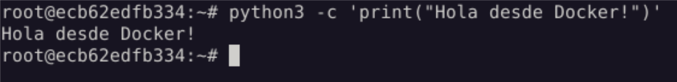

# Docker con GUI

### David Martinez Parra
### ASIXc2

***

En primer lugar deberemos clonar el repositorio:
`git clone https://github.com/DavidMartinezITB/dockergui`

Tras esto, crearemos la imagen:
`docker build -t xfce-vnc-dmp-img .`


Tras varios minutos, veremos que la imagen se crea correctamente.

Ahora creamos una instancia de contenedor con esa imagen:
```
docker run -d --name xfce-vnc-dmp \
  -p 5901:5901 \
  -p 2222:22 \
  --shm-size="1gb" \
  xfce-vnc-dmp-img
```


***

Una vez el contenedor levantado:

Podemos conectarnos por SSH:


Podemos conectarnos por VNC utilizando cualquier cliente disponible:


Vemos que python funciona:


Y por ultimo vemos que vs code funciona:
